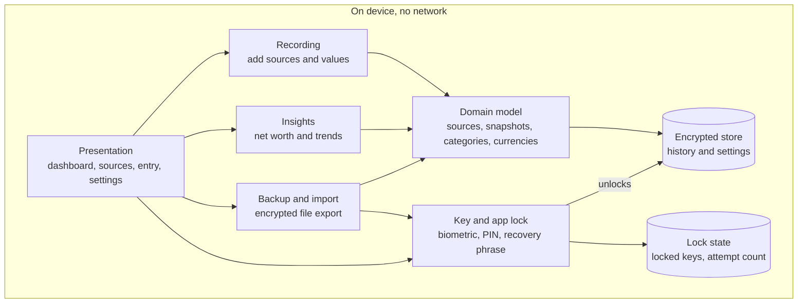
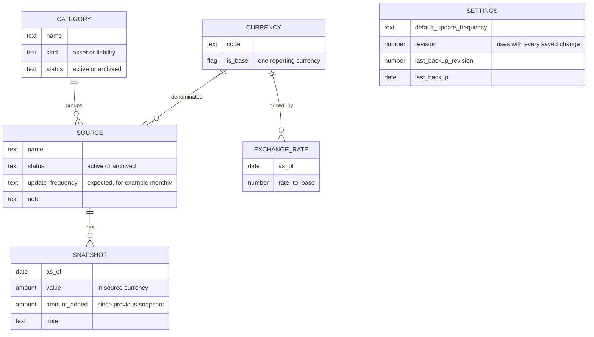

# Fortuna architecture

Fortuna is a wealth tracker. It records what each of a user's sources of wealth is worth over time and shows how the total and each source have changed.

This document describes the high-level design only. It deliberately says nothing about implementation or technology choices.

## Goals and constraints

- Track wealth over time across many sources, including liabilities.
- Let the user add sources and new values occasionally, keeping the history of each source.
- Support sources held in different currencies.
- Separate money the user put in from growth the source earned.
- Keep all data offline on the device, encrypted at rest.
- Give the user a way to recover their data if they forget their PIN or change device.

## Core idea: snapshots, not transactions

The basic record is a snapshot: "source X was worth Y on date Z". Users open the app now and then and enter current balances. They do not log individual movements.

- Net worth on any date is the sum of each source's most recent snapshot on or before that date.
- Change per source is the difference between two of its snapshots.
- Sources update independently, so a pension checked yearly and a bank account checked monthly coexist without gaps.

Everything shown on screen is derived from snapshots and exchange rates. No calculated figure is stored.

## Layers

| Component | Responsibility |
|---|---|
| Presentation | Shows the dashboard, source list and entry forms, and the setup, lock and recovery screens. Holds no financial logic. |
| Recording | Creates and edits sources and snapshots, and validates input. Includes a "quick update" flow that walks through every active source, since that is the main recurring action. |
| Insights | Turns snapshots and rates into the net worth timeline, per-source change, allocation and period comparisons. |
| Backup and import | Writes an encrypted file the user can keep wherever they like, and restores from it. Provides the spreadsheet template and bulk-imports history from it. |
| Domain model | Defines the entities and the rules they obey. |
| Encrypted store | The single source of truth for history and settings, encrypted at rest. Applies a group of related changes completely or not at all. |
| Key and app lock | Gates access to the app, holds the key that unlocks the store, and protects backup files. |
| Lock state | Holds what is needed before the store is open: the locked copies of the data key and the count of failed attempts. Contains no financial data. |

## Domain model

### Entities

- **Source**: anything that holds value, such as a bank account, brokerage, pension, property or loan. It belongs to one category and has one currency. It also has an expected update frequency, used to mark it as out of date.
- **Snapshot**: the value of one source on one date, with the net amount added since the previous snapshot and an optional note.
- **Category**: a grouping such as cash, investments, property or debt. It decides whether its sources are assets or liabilities.
- **Currency**: a currency in use. Exactly one is the base currency that totals and charts are reported in.
- **Exchange rate**: the rate from a currency to the base currency on a date.
- **Settings**: a single record of app-wide values: the default update frequency for new sources, a revision number, the revision at which the last backup was made, and the date of that backup.

### Whether the backup is up to date

- The revision number rises by one with every saved change.
- Making a backup records the current revision and today's date. Recording them does not count as a change, so it does not raise the revision.
- The backup is up to date when the two revisions match. Dates cannot answer this, because a backup and a later change often fall on the same day.
- The date of the last backup is kept only to show it to the user.
- Restored data counts as backed up, because it is identical to the file it came from.

### Liabilities

- Asset or liability is a property of the category, so a source inherits it and the rule lives in one place.
- Values are always entered as positive amounts. The sign is applied only in calculations: net worth is assets minus liabilities.

### Multiple currencies

- A source's snapshots are recorded in the source's own currency, exactly as the statement shows.
- Exchange rates are their own dated records, not a field on each snapshot. One rate then serves every source in that currency, and the timeline can value a source on dates when it had no snapshot.
- Rates follow the same rule as snapshots: use the latest one on or before the date in question.
- Because the app is offline, rates are entered by hand. The update flow shows the last rate and its age for each foreign currency in use, and entering a fresh one is optional.

### Amount added

- Each snapshot carries the net amount added since the previous snapshot of that source: deposits minus withdrawals, in the source's currency.
- For a liability it means new borrowing minus repayments, so the unexplained remainder is interest and charges.
- The first snapshot of a source is an opening balance. It counts as neither added nor growth.

### Splitting a change into its parts

The change in a source between two snapshots, expressed in the base currency, splits into three parts. The total change is the closing value converted at the closing rate, minus the opening value converted at the opening rate.

| Part | Definition |
|---|---|
| Added | Amount added, converted at the closing rate |
| Growth | Closing value minus opening value minus amount added, converted at the closing rate |
| Currency effect | The remainder: total change minus the other two parts |

- Taking the currency effect as the remainder guarantees the three parts add up to the total after each has been rounded.
- Before rounding, the remainder equals the opening value multiplied by the change in rate.
- Rounding can leave a remainder of one smallest unit on a foreign-currency source even when the rate has not moved.

Worked example, with a US brokerage account and GBP as the base currency:

| | January | April |
|---|---|---|
| Value | $10,000 | $11,500 |
| Amount added | n/a | $1,000 |
| Rate to GBP | 0.80 | 0.75 |
| Value in GBP | £8,000 | £8,625 |

The £625 increase breaks down as:

- Added: $1,000 at 0.75 is £750.
- Growth: the remaining $500 at 0.75 is £375.
- Currency effect: the remainder, £625 minus £750 minus £375, which is −£500. It is the opening $10,000 losing 0.05 per dollar.

### Splitting the change in net worth over a period

The dashboard and the update summary need the same split across all sources and for any period, not only between two snapshots of one source. A fourth part is needed as well, because a source added during the period raises net worth by its opening balance, which is neither added nor growth.

For each source, over a period from a start date to an end date:

| Part | Definition |
|---|---|
| Total change | Value on the end date minus value on the start date, each converted at the rate on that date. A source not yet tracked on the start date has a starting value of zero. |
| Newly tracked | The opening balance, if its date falls in the period, converted at the rate on that date |
| Added | The amount added of every snapshot dated in the period, each converted at the rate on its date |
| Growth | The growth of every snapshot dated in the period, each converted at the rate on its date |
| Currency effect | The remainder: total change minus the other three parts |

- A snapshot is in the period if its date is after the start date and on or before the end date.
- The value and the rate on a date are the latest ones on or before it.
- Each part is summed across sources. A liability's parts are subtracted.
- The currency effect is the remainder here too, so the parts always add up to the total. It is zero for sources in the base currency.
- The update summary uses the period from the most recent earlier date on which any snapshot was recorded to the date of the update.

### Rules

- A source has at most one snapshot per date. A second entry for the same date replaces the first.
- A currency has at most one rate per date.
- No snapshot or exchange rate is dated in the future.
- A foreign currency has a rate on or before its earliest snapshot, so every snapshot can be converted.
- Names are unique among active sources.
- A source's currency cannot change once it has snapshots. If an account is converted, archive it and start a new one.
- Sources and categories with history are archived, never deleted. The exception is a source that has only its opening snapshot, which can be deleted to undo a mistake.
- Changing the base currency is rare and needs rates against the new base, so it is a deliberate settings action.
- A change that touches several records is applied completely or not at all. This covers import, restore, closing a source and the adjustments made when backfilling.

### Known limit

Sources are updated independently, so money moved between two sources updated on different dates shows as a temporary dip or rise in net worth until both are updated. Updating all sources in one sitting avoids it.

## Privacy and recovery

- **No network.** The app never sends data anywhere. There is no account and no server.
- **One data key** encrypts the store. It is never shown to the user.
- **Locked copies of the data key.** The data key is kept in two locked copies: one opened by the everyday PIN, and one opened by a recovery phrase shown once at setup for the user to write down. Biometric unlock, when added, is a third.
- **Lock state.** The locked copies and the count of failed attempts are kept outside the encrypted store, because they are needed before it can be opened. The count survives closing the app, so the growing delay cannot be reset.
- **Forgotten PIN:** entering the recovery phrase unlocks the data key and lets the user set a new PIN.
- **Backup files** contain the encrypted data together with the copy of the data key locked by the recovery phrase. The user therefore does not need the phrase to make a backup, and the file can only be opened with it.
- **New device:** the recovery phrase opens the backup and the user sets a new PIN. The PIN is not part of a backup, because anything tied to the old device does not survive the move.
- **Replacing the recovery phrase** also replaces the data key, and the store is encrypted again with the new one. Otherwise someone holding the old phrase and an old backup would still hold the key to newer data. Backups made earlier still open with the old phrase only, so the app asks for a fresh backup.
- **Format version.** The store and every backup file record the version of their format, so a later version of the app can still read a backup made today.
- **Both lost:** if the PIN and the recovery phrase are both lost, the data is unrecoverable. That is the cost of having no server, and the setup screen must say so plainly.

### Where data crosses the app's boundary

The encrypted store protects data only while it stays in the app. These are the points where data leaves or enters:

| Crossing | Protection |
|---|---|
| Encrypted backup file | Protected by the recovery phrase wherever the user keeps it |
| The device's automatic cloud backup | The store and the lock state are excluded from it, so nothing leaves the device without the user choosing to |
| Spreadsheet import file | Unprotected. It is created and filled in outside the app, so the app tells the user to delete it after importing |
| Unencrypted spreadsheet export (future) | Unprotected. The app says so at the point of export |
| Recovery phrase on screen | Shown only at setup and when replaced, for the user to write down |

## Consequences of staying offline

- Backup is essential. With no server, a lost phone without a backup means lost history, so encrypted export belongs in the first version.
- There is no automatic bank sync. All entry is manual or by file import.
- Exchange rates cannot be fetched and are entered by hand.

### Room for network features

The [roadmap](roadmap.md) lists two future features that would relax this constraint: automatic exchange rates and open banking connections. Both would be opt-in and off by default.

They would live in a separate, optional connectors component, so the rest of the app stays offline:

- It is the only part of the app allowed to use the network.
- It adds rates and balances through Recording, under the same rules as manual entry.
- It cannot read stored values. A request carries only what it needs, such as currency codes.

## Open items

- The design of open banking connections, listed in the [roadmap](roadmap.md).
- How a web version would unlock, if that platform is added. See the [technology choices](technology.md).
