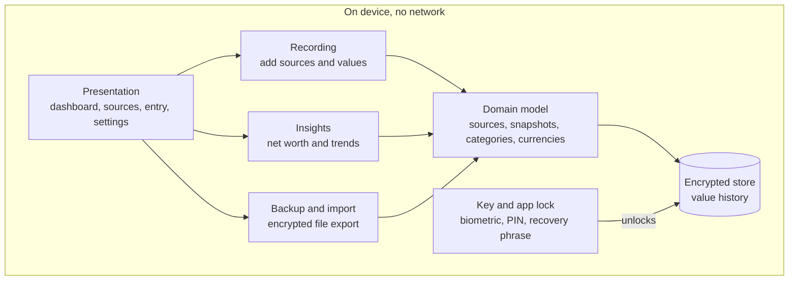
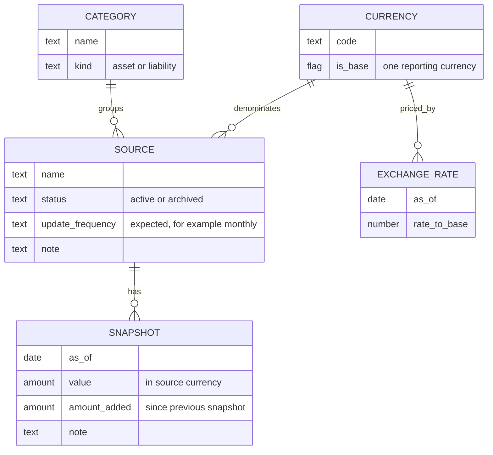

# Fortuna architecture

Fortuna is a wealth tracker. It records what each of a user's sources of wealth is worth over time and shows how the total and each source have changed.

This document describes the high-level design only. It deliberately says nothing about implementation or technology choices.

## Goals and constraints

- Track wealth over time across many sources, including liabilities.
- Let the user add sources and new values occasionally, keeping the history of each source.
- Support sources held in different currencies.
- Separate money the user put in from growth the source earned.
- Keep all data offline on the device, encrypted at rest.
- Give the user a way to recover their data if they forget their PIN or change device.

## Core idea: snapshots, not transactions

The basic record is a snapshot: "source X was worth Y on date Z". Users open the app now and then and enter current balances. They do not log individual movements.

- Net worth on any date is the sum of each source's most recent snapshot on or before that date.
- Change per source is the difference between two of its snapshots.
- Sources update independently, so a pension checked yearly and a bank account checked monthly coexist without gaps.

Everything shown on screen is derived from snapshots and exchange rates. No calculated figure is stored.

## Layers

| Component | Responsibility |
|---|---|
| Presentation | Shows the dashboard, source list and entry forms. Holds no financial logic. |
| Recording | Creates and edits sources and snapshots, and validates input. Includes a "quick update" flow that walks through every active source, since that is the main recurring action. |
| Insights | Turns snapshots and rates into the net worth timeline, per-source change, allocation and period comparisons. |
| Backup and import | Writes an encrypted file the user can keep wherever they like, and restores from it. Can bulk-import history from a spreadsheet. |
| Domain model | Defines the entities and the rules they obey. |
| Encrypted store | The single source of truth, encrypted at rest. |
| Key and app lock | Gates access to the app and holds the key that unlocks the store. |

## Domain model

### Entities

- **Source**: anything that holds value, such as a bank account, brokerage, pension, property or loan. It belongs to one category and has one currency. It also has an expected update frequency, used to mark it as out of date.
- **Snapshot**: the value of one source on one date, with the net amount added since the previous snapshot and an optional note.
- **Category**: a grouping such as cash, investments, property or debt. It decides whether its sources are assets or liabilities.
- **Currency**: a currency in use. Exactly one is the base currency that totals and charts are reported in.
- **Exchange rate**: the rate from a currency to the base currency on a date.

### Liabilities

- Asset or liability is a property of the category, so a source inherits it and the rule lives in one place.
- Values are always entered as positive amounts. The sign is applied only in calculations: net worth is assets minus liabilities.

### Multiple currencies

- A source's snapshots are recorded in the source's own currency, exactly as the statement shows.
- Exchange rates are their own dated records, not a field on each snapshot. One rate then serves every source in that currency, and the timeline can value a source on dates when it had no snapshot.
- Rates follow the same rule as snapshots: use the latest one on or before the date in question.
- Because the app is offline, rates are entered by hand. The update flow should prompt for a fresh rate for each foreign currency in use.

### Amount added

- Each snapshot carries the net amount added since the previous snapshot of that source: deposits minus withdrawals, in the source's currency.
- For a liability it means new borrowing minus repayments, so the unexplained remainder is interest and charges.
- The first snapshot of a source is an opening balance. It counts as neither added nor growth.

### Splitting a change into its parts

The change in a source between two snapshots, expressed in the base currency, splits into three parts:

| Part | Definition |
|---|---|
| Added | Amount added, converted at the closing rate |
| Growth | Closing value minus opening value minus amount added, converted at the closing rate |
| Currency effect | Opening value multiplied by the change in rate |

Worked example, with a US brokerage account and GBP as the base currency:

| | January | April |
|---|---|---|
| Value | $10,000 | $11,500 |
| Amount added | n/a | $1,000 |
| Rate to GBP | 0.80 | 0.75 |
| Value in GBP | £8,000 | £8,625 |

The £625 increase breaks down as:

- Added: $1,000 at 0.75 is £750.
- Growth: the remaining $500 at 0.75 is £375.
- Currency effect: the opening $10,000 lost 0.05 per dollar, which is −£500.

### Rules

- A source has at most one snapshot per date. A second entry for the same date replaces the first.
- A source's currency cannot change once it has snapshots. If an account is converted, archive it and start a new one.
- Sources and categories with history are archived, never deleted.
- Changing the base currency is rare and needs rates against the new base, so it is a deliberate settings action.

## Privacy and recovery

- **No network.** The app never sends data anywhere. There is no account and no server.
- **One data key** encrypts the store. It is never shown to the user.
- **Two ways to unlock the data key:** the everyday PIN or biometric, and a recovery phrase shown once at setup for the user to write down.
- **Forgotten PIN:** entering the recovery phrase unlocks the data key and lets the user set a new PIN.
- **New device:** backup files are protected by the recovery phrase, not the PIN, because anything tied to the old device does not survive the move.
- **Both lost:** the data is unrecoverable. That is the cost of having no server, and the setup screen must say so plainly.

## Consequences of staying offline

- Backup is essential. With no server, a lost phone without a backup means lost history, so encrypted export belongs in the first version.
- There is no automatic bank sync. All entry is manual or by file import.
- Exchange rates cannot be fetched and are entered by hand.

The [roadmap](roadmap.md) lists two future features that would relax this constraint: automatic exchange rates and open banking connections. Both would be opt-in.

## Open items

- The design of open banking connections, listed in the [roadmap](roadmap.md).
- Technology and implementation choices for each layer.
