# Fortuna implementation plan

This document orders the work of building the first version (the MVP) in the [roadmap](roadmap.md), using the choices in the [technology document](technology.md). It starts with small, independent pieces of the shared core, each with its own tests, then assembles them, then connects them to the Android app one group of screens at a time.

Starting point: the repository holds the design documents and no code. The Hello World project from the earlier sanity check is not in it yet.

## How the plan works

- **One step, one pull request.** Each step is small enough to review in one sitting.
- **Every step ends in something that can be checked.** Either tests that pass, or an installable app that does one more thing than before.
- **Inside out.** The core is finished and tested before any real screen is built, so the screens only display and collect. They hold no financial or security logic.
- **Checked without a computer.** From step 00, every pull request runs the core tests, compiles the Linux target and builds a debug app that can be downloaded and installed on a phone.
- **Tests come from the documents.** The worked examples in the [architecture](architecture.md) and each rule in the [user flows](user-flows.md) become named test cases.

There are four stages:

| Stage | Steps | What exists at the end |
|---|---|---|
| Foundation | 00 | An empty project that builds, tests and produces an app on every pull request |
| Building blocks | 01 to 05 | Five independent pieces, each tested alone |
| The core, assembled | 06 to 13 | The whole app working without a screen, proven by an end-to-end test |
| The Android app | 14 to 22 | The MVP, a group of screens at a time |

## Steps at a glance

| Step | Name | Result | Checked by |
|---|---|---|---|
| 00 | Project skeleton and checks | Two modules, the three checks, a hardened manifest | Checks pass; app installs |
| 01 | Money | Exact amounts in a currency's smallest unit | Tests |
| 02 | Rates and conversion | Decimal rates, one rounding rule | Tests |
| 03 | Dated values | "Latest on or before a date" lookup | Tests |
| 04 | Recovery phrase | Twelve words to and from random bytes | Tests |
| 05 | Cryptography wrapper | Encrypt, decrypt, derive a key, random bytes | Tests |
| 06 | Entities and dataset | The domain model and its saved form | Tests |
| 07 | Recording rules | Every change the MVP allows, with its rules | Tests |
| 08 | Insights | Net worth, timeline, source history | Tests |
| 09 | Encrypted file format | One versioned format for the store and backups | Tests |
| 10 | Document store | Load, change and save the dataset safely | Tests |
| 11 | Keys and lock state | PIN, recovery phrase, growing delay | Tests |
| 12 | Backup and restore | Export a file, restore it on a fresh device | Tests |
| 13 | Session | The app's states and auto-lock; the whole core end to end | Tests |
| 14 | Android adapters | Keystore, private files, clock, lifecycle | Tests on a device |
| 15 | Setup and unlock | S-01 to S-05, S-07 | App |
| 16 | First source and dashboard | S-11, S-09 | App |
| 17 | Source page and value entry | S-10, S-12 | App |
| 18 | Periodic update | S-13, S-14 | App |
| 19 | Foreign currencies | Rate entry, S-15, S-16 | App |
| 20 | Recovery, backup and restore | S-08, S-17, S-06 | App |
| 21 | Charts | Timeline on S-09, history on S-10 | App |
| 22 | MVP release check | Frozen file format, release build | App |

Screen numbers refer to the [screen map](screen-map.md).

## What depends on what

```mermaid
flowchart TB
    subgraph blocks["Building blocks"]
        money["01 Money"]
        rates["02 Rates and conversion"]
        dated["03 Dated values"]
        phrase["04 Recovery phrase"]
        crypto["05 Cryptography wrapper"]
    end
    subgraph core["The core, assembled"]
        entities["06 Entities and dataset"]
        rules["07 Recording rules"]
        insights["08 Insights"]
        format["09 Encrypted file format"]
        store["10 Document store"]
        keys["11 Keys and lock state"]
        backup["12 Backup and restore"]
        session["13 Session"]
    end
    subgraph app["The Android app"]
        adapters["14 Android adapters"]
        screens["15 to 22 Screens"]
    end

    money --> rates
    rates --> entities
    dated --> entities
    entities --> rules
    entities --> insights
    crypto --> format
    format --> store
    entities --> store
    crypto --> keys
    phrase --> keys
    store --> backup
    keys --> backup
    rules --> session
    insights --> session
    backup --> session
    session --> adapters
    adapters --> screens
```

- Steps 01, 03, 04 and 05 depend on nothing and can be done in any order.
- The domain steps (06 to 08) and the protection steps (09, 11) do not depend on each other. They meet at step 10.
- The building blocks are packages inside the `core` module, not separate Gradle modules. This follows the two-module structure in the technology document. The arrows above are the only dependencies allowed between packages.

## Stage 1: foundation

### Step 00: project skeleton and checks

- **Builds:**
  - Gradle with the Kotlin DSL and a version catalog.
  - `core`: a Kotlin Multiplatform module with Android, JVM and Linux targets, and all code in the common source set.
  - `androidApp`: the Hello World app, with its greeting supplied by a function in `core`.
  - Manifest: no `INTERNET` permission, `allowBackup` off, data extraction rules that exclude the app's files.
  - GitHub Actions on every pull request: run the core tests, compile the Linux target, build the debug app and attach it.
- **Tests:** one trivial core test, and a check that the built app's manifest does not contain the `INTERNET` permission.
- **Done when:** a pull request shows all checks passing, and the app downloaded from it installs and shows the greeting from `core`.

## Stage 2: building blocks

Each block is pure Kotlin with no file access, no clock and no dependency on the others, except that rates build on money.

### Step 01: money

- **Builds:** `Currency` (code and number of decimal places) and `Money` (a whole number of the smallest unit, in one currency). Reading an amount from decimal text and writing it back. Add, subtract and negate.
- **Tests:**
  - "10000.00" in pounds is 1,000,000 pence and writes back unchanged.
  - A currency with no decimal places, such as yen.
  - Too many decimal places is rejected.
  - Adding two different currencies is rejected.
- **Done when:** no floating-point type appears anywhere in the package.

### Step 02: rates and conversion

- **Builds:** `Rate`, read from decimal text and held as a decimal, with `kotlin-multiplatform-bignum` used only inside it. One conversion function: multiply, then round half-up to the target currency's smallest unit.
- **Tests:**
  - From the architecture's example: $10,000 at 0.80 is £8,000, and $11,500 at 0.75 is £8,625.
  - Results that land exactly half-way.
  - Negative amounts.
  - Currencies with different numbers of decimal places.
  - A zero or negative rate is rejected.
- **Done when:** conversion and rounding exist in exactly one function.

### Step 03: dated values

- **Builds:** a small generic collection of records keyed by calendar date (`kotlinx-datetime`). It answers "the latest on or before this date" and enforces one record per date, where a second entry for a date replaces the first. Snapshots and rates both use it.
- **Tests:** empty; a date before the first record; an exact date; between two records; after the last; replacing a record.

### Step 04: recovery phrase

- **Builds:** the 2,048-word BIP39 list held in the core. Sixteen random bytes become twelve words, and twelve words become the bytes again after the checksum is verified. Typed input is tidied (case, extra spaces). An unknown word is reported by its position.
- **Tests:**
  - The published BIP39 test vectors, in both directions.
  - A fixed example with one word swapped for another fails the checksum.
  - A word not in the list is named in the error.
- **Done when:** the package takes its random bytes as input, so it needs no cryptography library of its own.

### Step 05: cryptography wrapper

- **Builds:** a small interface of our own with four operations: random bytes, AES-256-GCM encryption and decryption with authenticated extra data, and PBKDF2 key derivation. It is implemented with `cryptography-kotlin`, and nothing else in the core imports that library.
- **Tests:**
  - Published test vectors for AES-GCM and PBKDF2.
  - Encrypt then decrypt returns the original.
  - A changed byte in the data, a changed byte in the extra data, and a wrong key are each rejected.
- **Done when:** the tests pass on the JVM and the Linux target compiles.

## Stage 3: the core, assembled

### Step 06: entities and dataset

- **Builds:** the entities in the architecture (category, source, snapshot, currency, exchange rate, settings) and one immutable `Dataset` that holds them all. The fixed starter categories. Reading and writing the dataset as JSON with `kotlinx.serialization`, including a format version.
- **Tests:**
  - A dataset written and read back is equal to the original.
  - A sample JSON file kept in the repository loads. This is the first format fixture.
- **Done when:** the dataset can express everything in the architecture's domain model, including the fields the MVP does not show yet (status, update frequency, the revision number and the revision of the last backup), so the saved format does not need to change when those features arrive.

### Step 07: recording rules

- **Builds:** every change the MVP allows, as a function that takes a dataset and returns either a new dataset or a named error. No function changes anything in place.
  - Choose the base currency.
  - Add a source with its opening snapshot.
  - Add a snapshot, edit a snapshot's value, amount added and note, and delete a source's latest snapshot.
  - Delete a source that has only its opening snapshot.
  - Add, correct and delete an exchange rate.
  - The periodic update's queue: the active sources whose latest snapshot is before the update date, the one updated longest ago first; the number of sources left out because they already have a value on or after that date; and the foreign currencies in use with each one's last rate and its age.
  - Every function that takes a date is also given today's date, so the rules stay free of the clock.
- **Tests:** one named test for each rule.
  - Names are unique among active sources.
  - The opening snapshot has no amount added.
  - A new snapshot must be dated on or after the source's latest one (MVP simplification).
  - A new snapshot dated the same as the latest one replaces it.
  - A replacement for the opening snapshot has no amount added.
  - A snapshot or a rate dated in the future is rejected.
  - The update queue leaves out a source with a value on or after the update date, and counts it.
  - A snapshot's date cannot be edited.
  - A foreign-currency source needs a rate on or before its opening date.
  - The rate that covers a currency's earliest snapshot cannot be deleted.
  - The base currency's rate is always one.
  - A second rate for a date replaces the first.
  - A source with more than its opening snapshot cannot be deleted.
  - A liability's value is entered as a positive amount.
- **Done when:** every rule under "Rules" in the architecture that applies to the MVP has a test that names it.

### Step 08: insights

- **Builds:** calculations over a dataset. Nothing is stored.
  - Net worth on a date: total assets, total liabilities and the difference, in the base currency.
  - The source list: each source's current value and the date it was last updated.
  - A source's history: for each snapshot, the change since the previous one, the amount added and the growth, with totals since the opening balance.
  - The timeline: net worth on each date in a period on which a value or a rate changed.
  - The split of a change between two snapshots into added, growth and currency effect, with the currency effect taken as the remainder.
- **Tests:**
  - The architecture's worked example: the £625 rise splits into £750 added, £375 growth and −£500 currency effect.
  - The parts add up to the total after rounding: $10.01 to $10.02 with nothing added, at rates 0.333 and 0.337, is a £0.05 rise made of £0.00 growth and £0.05 currency effect.
  - A liability is subtracted.
  - A source does not count before its opening date.
  - A source with no new snapshot keeps its last value.
  - A transfer recorded as a negative and a positive amount added cancels in the total.
  - A new rate moves net worth on its own date.
- **Note:** the currency effect is not shown in the MVP. The two-snapshot split is built now because the technology document names it as one of the first things to test and it exercises steps 01 to 03 together. The split across all sources for a period is left for after the MVP.

### Step 09: encrypted file format

- **Builds:** one file format used by both the store and backups. A header (a marker, the format version, key derivation settings, salts and the nonce) followed by the dataset encrypted with AES-256-GCM. The header is authenticated together with the data. A backup is the same file with the recovery-locked copy of the data key in its header.
- **Tests:**
  - Seal then open returns the original bytes.
  - Changing any single byte of the header or the body is rejected.
  - A wrong key is rejected.
  - An unknown format version is rejected with its own error, before anything is decrypted.
  - A file kept in the repository opens with a known key. This is the fixture that later versions must keep reading.

### Step 10: document store

- **Builds:** the `Private files` port and its Okio implementation. The store: open the file with the data key and hold the dataset in memory, exposed as a flow; apply a recording rule, raise the revision number by one and write the result as a new file that is moved into place; discard the key and the dataset on lock. On start, recover a new file left waiting by an interrupted move. The store is the one place the revision is raised. It also offers a second kind of write for bookkeeping, such as the record of a backup, which saves without raising the revision.
- **Tests:** against Okio's in-memory file system.
  - A change is still there after the store is closed and reopened.
  - Each saved change raises the revision by one.
  - A rule that returns an error leaves the file and the revision untouched.
  - A write interrupted before the move leaves the old data readable.
  - A write interrupted after the move is recovered on start.
  - After locking, the store holds no data.

### Step 11: keys and lock state

- **Builds:**
  - The data key, and its two locked copies: one under the PIN (PBKDF2, then wrapped by the device key) and one under the recovery phrase (PBKDF2 only).
  - The `Device key` and `Clock` ports, with stand-ins for tests.
  - The lock state file: the locked copies, salts and settings, and the count of failed attempts. It has its own format version.
  - Operations: set up with a PIN and return the phrase; unlock with the PIN; recover with the phrase and set a new PIN.
  - PIN rules: digits only, six or more.
  - The growing delay. The count is saved before a PIN is checked, so closing the app during an attempt cannot avoid it.
- **Tests:**
  - Set up, then unlock with the right PIN.
  - A wrong PIN is refused, the count rises and the wait grows.
  - The count and the wait survive a restart.
  - A right PIN during the wait is still refused.
  - Recovery with the phrase sets a new PIN, leaves the phrase and the data unchanged, and clears the count.
  - A wrong phrase changes nothing.
  - A lock state copied to a device with a different device key cannot be opened with the PIN.

### Step 12: backup and restore

- **Builds:** export, which produces the backup file without asking for the phrase and records the date of the backup and the revision it was made at, without raising the revision. Restore, which opens a backup with the phrase, then writes the store and a new lock state under a new PIN in one go.
- **Tests:**
  - Back up on one stand-in device and restore on another: the datasets are equal.
  - After a backup, the revision of the last backup equals the current revision. A change made later the same day raises the current revision past it.
  - After a restore, the two revisions are equal.
  - A wrong phrase changes nothing on the device.
  - A damaged file changes nothing on the device.
  - A backup file kept in the repository restores with a known phrase.

### Step 13: session

- **Builds:**
  - The app's states: no data, setting up, restoring, locked, unlocked. One entry point for the interface, which exposes the current state as a flow and offers the use cases for recording, insights and backup.
  - The `App lifecycle` port and the auto-lock rule: lock one minute after leaving the foreground, two minutes if a value is being entered, and always when the app is closed or the phone restarts.
- **Tests:**
  - The grace periods, run against a virtual clock.
  - No use case is reachable while locked.
  - **End to end, with no screen:** set up; add an asset, a liability and a foreign-currency source; run two periodic updates with a skipped source; lock and unlock; correct a value; back up; restore on a second stand-in device; check net worth and each source's history at every stage.
- **Done when:** the end-to-end test passes. From here on, the Android work adds no logic.

## Stage 4: the Android app

Each step from 15 onward produces an app that does one more useful thing. Screens get a view model that calls the session, and view model tests that use the real core with stand-in ports.

The screens where a value is entered (S-11 to S-14) each get the two-minute grace period, and keep what was typed across a lock, in the step that builds them.

### Step 14: Android adapters

- **Builds:** `Device key` on the Android Keystore (StrongBox where the phone has it), `Private files` on the app's private directory, `Clock`, and `App lifecycle` on `ProcessLifecycleOwner`. The core is created once and handed to the interface.
- **Tests:** run on a device or emulator.
  - A secret wrapped by the device key unwraps after the app is restarted.
  - A file replaced through the adapter is complete after a restart.
  - The core's cryptography tests pass on the lowest supported Android version.
- **Done when:** the app from step 00 starts, creates the core and reports "no data on device".

### Step 15: setup and unlock

- **Builds:** S-01 Welcome (new start only), S-02 Create PIN, S-03 Recovery phrase, S-04 Confirm phrase, S-05 Base currency, S-07 Lock, and a placeholder dashboard. Navigation, with the lock screen placed over whatever was open. `FLAG_SECURE`. The one-minute auto-lock.
- **Done when:** on a phone, the user can complete setup, close the app, reopen it, be refused with a wrong PIN and made to wait, and get in with the right one. Figures and the phrase do not appear in the app switcher.

### Step 16: first source and dashboard

- **Builds:** S-11 Add source, limited to the base currency for now. S-09 Dashboard with net worth, total assets, total liabilities and the source list, and the empty state that invites the first source.
- **Done when:** the user can add an asset and a liability and see the three totals. The data is still there after locking and after restarting the phone.

### Step 17: source page and value entry

- **Builds:** S-10 Source, with the snapshot list (change, amount added and growth for each) and totals since the opening balance. S-12 Value entry for a new value and for editing one, with the confirm dialog when a new value replaces the one already recorded for that date. Deleting the latest snapshot, and deleting a source that has only its opening snapshot, each behind the confirm dialog.
- **Done when:** the user can record a new value, correct it, replace it by entering the same date again, delete it, and remove a source created by mistake. The dashboard totals follow each change.

### Step 18: periodic update

- **Builds:** S-13 Update, with the date and the number of sources left out, and no rates for now. S-14 Update: source step, which walks the sources from the one updated longest ago, and lets the user enter a value and amount added or skip.
- **Done when:** the user can update every source in one sitting, leave half-way, and on starting again with the same date continue with the sources not yet updated. An update dated before a source's latest value leaves that source out and says so.

### Step 19: foreign currencies

- **Builds:** the rate entry dialog. The full currency choice on S-11, which asks for a rate when the currency has none. The rates section of S-13. S-15 Settings and S-16 Currencies and rates.
- **Done when:** the user can add a source in another currency, see it counted in the base currency, enter a newer rate during an update or from settings, and see net worth move. The rate that the earliest snapshot depends on cannot be deleted.

### Step 20: recovery, backup and restore

- **Builds:** a twelve-word entry component, shared by two screens. S-08 Enter recovery phrase. The `Document picker` port on the Storage Access Framework. S-17 Backup. S-06 Restore, with the restore choice added to S-01.
- **Done when:** on a phone, the user can get back in with the phrase and set a new PIN; export a backup; uninstall the app, install it again and restore from the file. A wrong phrase or a damaged file leaves the fresh install unchanged.

### Step 21: charts

- **Builds:** one chart composable, with the library (Koalaplot or Vico) chosen here. The net worth timeline on S-09 and the value over time on S-10.
- **Done when:** both charts draw from the figures step 08 already produces, and still read sensibly with one data point, with two, and with several years of history.

### Step 22: MVP release check

- **Builds:** nothing new. The file formats are frozen as version 1 and their fixtures are locked. A release build with code shrinking. Empty and error states on every screen. A manual test script that follows the flow coverage table in the screen map.
- **Done when:** every MVP flow in the roadmap passes the manual script on a real phone, with a release build.

## Flow coverage

| MVP flow | Core steps | App step |
|---|---|---|
| UF-01 First-time setup | 04, 07, 11, 13 | 15 |
| UF-02 Unlock the app | 11, 13 | 15 |
| UF-03 Add a source | 07 | 16, and 19 for foreign currencies |
| UF-04 Periodic update, basic | 07 | 18, and 19 for rates |
| UF-05 Update a single source | 07 | 17 |
| UF-06 Corrections, basic | 07 | 17 |
| UF-09 Currencies and rates, basic | 02, 07 | 19 |
| UF-10 Net worth, basic | 08 | 16, and 21 for the timeline |
| UF-11 View a source, basic | 08 | 17, and 21 for the chart |
| UF-12 Back up | 12 | 20 |
| UF-13 Restore from a backup | 12 | 20 |
| UF-14 Recover from a forgotten PIN | 11 | 20 |

## Decisions to make along the way

The design documents leave these open. Each is listed with the step that needs it and a suggested answer.

| Decision | Needed at | Suggestion |
|---|---|---|
| How half-up rounding treats negative amounts | 02 | Round half away from zero, so converting −x always gives minus the conversion of x and transfers still cancel |
| Which currencies are offered, and their decimal places | 01, 16 | A fixed list built into the core, taken from ISO 4217 |
| How the timeline picks its dates | 08 | Every date on which a value or a rate changed |
| PBKDF2 round counts, and the exact text of the phrase that is fed in | 09, 11 | Fix both in the version 1 format; store the round count in the header so it can rise later |
| The schedule of the growing delay | 11 | A few free attempts, then 30 seconds, 1, 5, 15 and 60 minutes |
| How the wait is measured, so that changing the phone's clock does not skip it | 11, 14 | Decide when the `Clock` port is defined; it needs more than today's date |
| How many words S-04 asks for | 15 | Three, at random positions |
| PBKDF2 with SHA-256 on Android 7 (SDK 24 and 25) | 05, 14 | To be confirmed by the step 14 device test. If the platform does not provide it there, either raise the minimum SDK to 26 or build PBKDF2 from the library's HMAC |
| Chart library | 21 | As the technology document says, decided when the charts are built |

Two notes on working order:

- **Data is disposable until step 20.** Before backup and restore exist, and before the format is frozen in step 22, real history should not be kept only in the app.
- **The saved format may change until step 22.** After that, any change needs a new format version and a new fixture.

## After the MVP

The future plans in the roadmap, in a suggested order. Each is one or more steps of the same shape: core first with tests, then the screen.

1. **Change breakdown for a period** (core), then the **update summary**, the "unchanged" shortcut and the typing-mistake check.
2. **Allocation by category** and **out-of-date markers**.
3. **Backfilling**, which lifts the date-order restriction.
4. **Close a source** and **manage categories**.
5. **Security settings:** change the PIN, replace the recovery phrase and the data key.
6. **Backup prompts** and **restore over existing data**.
7. **Biometric unlock**, which adds the `Biometric gate` port.
8. **Spreadsheet import**, then **unencrypted export**.
9. **Base-currency view of a source** and **change base currency**.
10. **Update reminders.**
11. **Network features**, after their own design.
