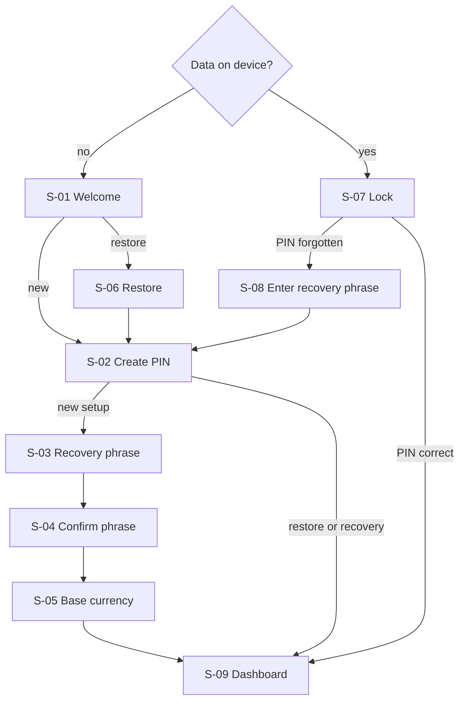
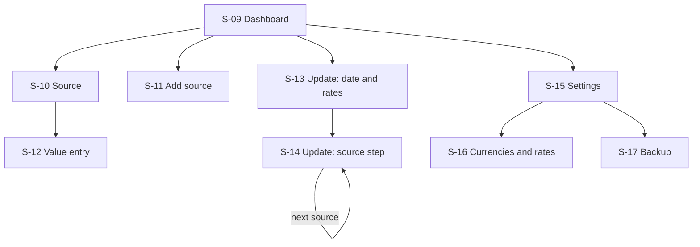

# Fortuna screen map

This document lists the screens of the first version (the MVP) and how the user moves between them. It is derived from the MVP flows in the [user flows](user-flows.md) and the [roadmap](roadmap.md).

It names each screen, says what it is for and where it leads. It does not describe layout or visual design.

## Structure

- **One home screen.** The dashboard is the home of the app. Every other screen is reached from it and returns to it. There are no tabs in the MVP, because there are too few destinations to need them.
- **The lock screen sits above everything.** When the app locks, the lock screen covers whatever was open. After unlocking, the user returns to the same screen with anything they had typed still there. The app waits a short grace period before locking; see [Locking in the background](#locking-in-the-background).
- **Setup is a fixed sequence.** Its screens are shown once, in order, and cannot be skipped.

There are seventeen screens: eight for getting in and nine for the main app.

## Getting in

| Screen | Purpose | Leads to | Flows |
|---|---|---|---|
| S-01 Welcome | Explains that data stays on the device, that there is no account, and that losing both the PIN and the recovery phrase means losing the data. Offers a new start or a restore. | S-02 or S-06 | UF-01, UF-13 |
| S-02 Create PIN | The user enters a PIN of six or more digits, twice. Used for a new setup, after a restore and after a recovery. | S-03 in a new setup, otherwise S-09 | UF-01, UF-13, UF-14 |
| S-03 Recovery phrase | Shows the twelve words for the user to write down. | S-04 | UF-01 |
| S-04 Confirm phrase | Asks for some of the words back. Cannot be skipped. | S-05 | UF-01 |
| S-05 Base currency | The user chooses the currency for totals and charts. | S-09 | UF-01 |
| S-06 Restore | The user picks a backup file and enters the recovery phrase. | S-02 | UF-13 |
| S-07 Lock | PIN entry. Shows the wait after failed attempts and offers the recovery phrase. | S-09, or S-08 | UF-02 |
| S-08 Enter recovery phrase | The user enters the twelve words to get back in. | S-02 | UF-14 |

Notes:

- In a new setup the PIN comes before the recovery phrase. In a restore the phrase comes first, because it opens the backup.
- The user can go back within setup until the phrase is confirmed. After that, setup only moves forward.
- S-03 is the only screen that shows the recovery phrase. S-04, S-06 and S-08 ask for it and never show it.

## Main app

Every screen below returns to the one it was opened from, and S-14 returns to the dashboard after the last source.

| Screen | Purpose | Leads to | Flows |
|---|---|---|---|
| S-09 Dashboard | Shows current net worth, total assets and total liabilities, the net worth timeline, and the list of sources with each value and when it was last updated. | S-10, S-11, S-13, S-15 | UF-10 |
| S-10 Source | Shows one source: its value over time in its own currency, its snapshots with the change, amount added and growth for each, and totals since the opening balance. | S-12 | UF-11, UF-05, UF-06 |
| S-11 Add source | Form for name, category, currency, opening value, date and note. | Back to S-09 | UF-03 |
| S-12 Value entry | Form for value, amount added, date and note. Used to add a new value and to edit an existing one. | Back to S-10 | UF-05, UF-06 |
| S-13 Update: date and rates | Starts a periodic update. The user confirms the date and, for each foreign currency, keeps the last rate or enters a new one. Says how many sources the update leaves out. | S-14 | UF-04, UF-09 |
| S-14 Update: source step | One source at a time, the one updated longest ago first. Shows the last value and date. The user enters a new value and amount added, or skips. | The next source, then S-09 | UF-04 |
| S-15 Settings | Entry point for currencies and rates and for backup. | S-16, S-17 | |
| S-16 Currencies and rates | Lists the currencies in use with the rates entered for each. The user adds or corrects a rate. | Back to S-15 | UF-09 |
| S-17 Backup | Explains that the file can only be opened with the recovery phrase, and exports it to a location the user picks. | Back to S-15 | UF-12 |

Notes:

- **Empty dashboard.** With no sources, the dashboard shows only an invitation to add the first one.
- **Dates.** No date can be in the future. On S-12 a new value is dated on or after the source's latest one.
- **A new value on the same date.** If the date of a new value on S-12 is the date of the source's latest snapshot, the new value replaces it after the user confirms. A replacement for the opening snapshot has no amount added.
- **Editing a value.** S-12 opens with the snapshot's figures filled in. The value, amount added and note can be changed. The date cannot, because moving a snapshot in time is backfilling, which comes later.
- **Deleting.** On S-10 the user can delete the latest snapshot. A source can be deleted only while it has just its opening snapshot.
- **A new foreign currency.** If the currency chosen on S-11 has no rate yet, the screen asks for one before saving.
- **Sources in an update.** S-14 walks through the active sources whose latest snapshot is before the update date. A source with a value on or after that date is left out, and S-13 says how many were left out and why once the date is chosen.
- **Stopping an update.** Each entry on S-14 is saved as it is made, so leaving part-way loses nothing. Starting an update again with the same date continues with the sources not yet updated, and offers the skipped ones again.

## Dialogs and system screens

These appear over a screen and are not destinations of their own.

| Dialog | Where | Purpose |
|---|---|---|
| Confirm delete | S-10 | Before deleting a snapshot or a source |
| Confirm replace | S-12 | Before a new value replaces the one already recorded for that date |
| Rate entry | S-11, S-13, S-16 | Enter or correct an exchange rate for a date |
| Date picker | S-11, S-12, S-13 | Choose a date |
| System file picker | S-06, S-17 | Choose the backup file to open, or where to save it |

## Flow coverage

Every MVP flow is reachable through these screens.

| Flow | Screens |
|---|---|
| UF-01 First-time setup | S-01 to S-05 |
| UF-02 Unlock the app | S-07 |
| UF-03 Add a source | S-11 |
| UF-04 Periodic update, basic | S-13, S-14 |
| UF-05 Update a single source | S-10, S-12 |
| UF-06 Corrections, basic | S-10, S-12 |
| UF-09 Currencies and rates, basic | S-16, with rate entry on S-11 and S-13 |
| UF-10 Net worth, basic | S-09 |
| UF-11 View a source, basic | S-10 |
| UF-12 Back up | S-17 |
| UF-13 Restore from a backup | S-01, S-06, S-02 |
| UF-14 Recover from a forgotten PIN | S-07, S-08, S-02 |

## Later screens

The future plans add screens or extend existing ones. They are listed here so the MVP navigation leaves room for them.

| Future plan | Effect on screens |
|---|---|
| Periodic update extras | A summary screen after S-14; an "unchanged" action on S-14 |
| Close a source | An action on S-10; a list of archived sources |
| Manage categories | A new screen under S-15 |
| Backfilling | S-12 allows any date and shows the adjustment to confirm |
| Change breakdown and allocation | New sections on S-09 |
| Base-currency view of a source | A switch on S-10 |
| Out-of-date markers | Markers on S-09; an update frequency field on S-11 |
| Import from a spreadsheet | A new screen under S-15, also offered on the empty dashboard |
| Unencrypted export | An action on S-17 |
| Biometric unlock and security settings | A new screen under S-15; a biometric prompt on S-07 |
| Change base currency | An action on S-16 |
| Update reminders | A setting on S-15 |

## Locking in the background

During a periodic update the user will often switch to a banking app to read a balance and come back. To keep that from costing a PIN entry every time, the app waits before locking once it leaves the foreground.

| Screen open when the app leaves the foreground | Grace period |
|---|---|
| S-11 Add source, S-12 Value entry, S-13 and S-14 Update | Two minutes |
| Any other screen | One minute |

- The longer period applies to the screens where the user is entering a value, because those are the ones that send them to another app to look something up.
- Returning within the grace period needs no PIN. After it, the lock screen appears and the user returns to the same screen once unlocked.
- Closing the app or restarting the phone always locks it, whatever the grace period.
