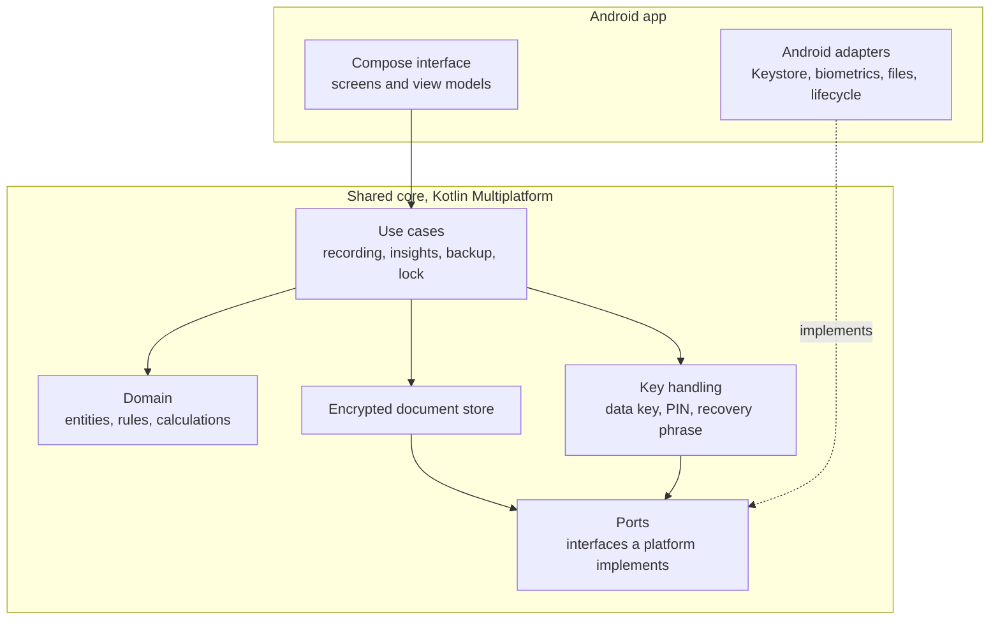

# Fortuna technology choices

This document says how the [architecture](architecture.md) will be built. It gives a recommendation for each layer, the reason, and the main alternative.

One requirement shapes every choice: everything behind the user interface is written once, in a form that can be reused on platforms beyond Android. Only the screens and the device integration are specific to a platform.

Library status below is as of October 2026. Sources are listed at the end.

## Decisions at a glance

| Area | Choice | Main alternative |
|---|---|---|
| Shared code | Kotlin Multiplatform core | Rust core with generated bindings |
| Storage | One encrypted document, held in memory while unlocked | SQLite with SQLCipher |
| Encryption | AES-256-GCM through `cryptography-kotlin` | libsodium bindings |
| Key from PIN | PBKDF2, then wrapped by a hardware-backed device key | Argon2id |
| Recovery phrase | Twelve words from the BIP39 word list | Random code in groups of characters |
| Serialization | `kotlinx.serialization`, JSON | CBOR or Protocol Buffers |
| Dates | `kotlinx-datetime` calendar dates | None |
| Money and rates | Integer minor units and a decimal library, behind our own types | Floating point (rejected) |
| Files | Okio | `kotlinx-io` |
| Android interface | Jetpack Compose | Compose Multiplatform from the start |
| Charts | Koalaplot or Vico, decided when the dashboard is built | Hand-drawn on a Compose canvas |
| Tests | `kotlin.test` in the shared core | Kotest |
| Build and checks | Gradle with Kotlin DSL, GitHub Actions | None |

## Shared core and platform shell

The shared core holds every architecture component except Presentation. A platform supplies two things: an interface, and a small set of adapters for what only the device can do.

| Architecture component | Where it lives |
|---|---|
| Presentation | Platform: Jetpack Compose on Android |
| Recording, Insights, Backup and import | Shared core, as use cases |
| Domain model | Shared core |
| Encrypted store | Shared core, writing through a file port |
| Key and app lock | Shared core for the logic; platform adapter for the hardware-backed key and biometrics |
| Lock state | Shared core for the format; platform adapter for where the file sits |

### Ports

A port is an interface the core defines and each platform implements. These are the only places the core touches the device.

| Port | What it does | Android implementation |
|---|---|---|
| Device key | Wraps and unwraps a small secret with a key that cannot leave the device | Android Keystore, StrongBox where available |
| Biometric gate | Releases a secret only after a biometric check | `androidx.biometric` with a Keystore key |
| Private files | Reads and replaces files in the app's own storage | App-private directory through Okio |
| Document picker | Lets the user choose where to save or open a file | Storage Access Framework |
| App lifecycle | Tells the core when the app leaves the foreground | `ProcessLifecycleOwner` |
| Clock | Supplies today's date | System clock |

Screen privacy (hiding figures in the app switcher) is handled in the Android interface with `FLAG_SECURE`, not through a port, because the core never draws anything.

## Shared code: Kotlin Multiplatform

**Recommendation.** Write the core as a Kotlin Multiplatform module with all code in the common source set.

**Why.**

- The project is already Kotlin, so there is one language across the core and the Android interface.
- Kotlin Multiplatform is stable on Android, iOS, desktop and server. Web through Kotlin/Wasm is in beta.
- The Android app uses the core as an ordinary Kotlin library, with no bridging layer.

**Alternative: a Rust core.** Rust compiles to every platform including the web, has a strong cryptography ecosystem, and exposes itself to Kotlin and Swift through generated bindings (UniFFI). It costs a second language, a bindings layer between the core and every interface, and a more complex build. It would be worth reconsidering only if the web became the main platform or a non-Kotlin team took over the core. For the web as a possible third platform, Kotlin's own web support is enough.

**How portability is enforced.**

- The core depends only on libraries that publish for all Kotlin targets.
- The core declares three targets from the start: Android, JVM and one native target (Linux). The native target exists to prove on every change that nothing Android-only or JVM-only has crept in. It can be compiled on the build server without a Mac.
- iOS is the next platform. Its target is added when that work starts, because compiling it requires a Mac.

**Structure.** Start with two modules and split the core later only if it grows:

- `core`: the shared module, with packages that mirror the architecture layers (domain, store, keys, use cases, ports).
- `androidApp`: the Compose interface and the Android adapters.

## Storage: one encrypted document

**Recommendation.** Keep all data as a single encrypted file. On unlock, the core decrypts it and holds the whole dataset in memory. On every change, it writes a new encrypted file and swaps it in place of the old one. On lock, it discards the data key and the dataset from memory.

**Why.**

- **The data is tiny.** Fifty sources updated monthly for twenty years is 12,000 snapshots, about a megabyte at most. Everything shown is calculated from the whole history anyway.
- **It is the most portable option.** It needs only file access and a cryptography library, both available on every Kotlin target. There is no native database to build and link per platform.
- **It matches the architecture directly.**
  - All-or-nothing changes come free, because the file is replaced in one step.
  - The backup file is the same format as the store, with the recovery-locked key attached.
  - Replacing the data key means writing the file once with a new key.
  - The format version is one field in the header.

**Alternative: SQLite with SQLCipher.** This is the conventional choice and scales to large datasets. It is the weaker option for a portable core: SQLCipher is a native library that has to be built and linked separately on each platform, and its vendor said in March 2025 that it does not officially support iOS through Kotlin Multiplatform. Community setups exist but add build complexity and risk for no benefit at this data size.

**What we give up.**

- The whole file is rewritten on each change. At this size that is not noticeable.
- There are no database queries. Calculations run over in-memory collections.
- Changes to the data format are handled in code, reading old versions and writing the current one.

**When to revisit.** If open banking brings in transaction-level data, the dataset could grow by orders of magnitude. The store sits behind an interface in the core, so it can be replaced by a database without touching the rest.

**File handling.** Okio provides file access on every target and an atomic move, which is what makes the swap safe: write the new file beside the old one, then move it into place. Okio guarantees the target never ends up holding part of a file. On Windows file systems the move can fail after removing the old file, so on start the core recovers a new file left waiting. `kotlinx-io` is the official alternative but is still in alpha.

## Cryptography

**Library.** `cryptography-kotlin` gives one Kotlin interface over each platform's own, audited cryptography: the JDK provider on Android and desktop, CryptoKit and CommonCrypto on Apple platforms, OpenSSL on Linux and Windows, and WebCrypto in browsers. It covers what the design needs (AES-GCM, PBKDF2, HKDF, HMAC, SHA-2) and no cryptographic primitive is written by hand. On Apple platforms its two providers are used together, because AES-GCM comes from one and PBKDF2 from the other. It is still before version 1.0, so its use is kept behind a small wrapper in the core.

**How the architecture's keys map to primitives.**

| Architecture term | Implementation |
|---|---|
| Data key | Random 256-bit key. Encrypts the document with AES-256-GCM, using a fresh random nonce on every write. |
| Copy locked by the PIN | The data key encrypted under a key derived from the PIN with PBKDF2, and then wrapped again by the device key. |
| Copy locked by the recovery phrase | The data key encrypted under a key derived from the phrase with PBKDF2. Not tied to the device, so it works after a move. |
| Copy for biometric unlock (future) | The data key wrapped by a device key that is released only after a biometric check. |
| Lock state | A small file holding the locked copies, their salts and settings, and the failed-attempt count. |
| Backup file | Header, the copy locked by the recovery phrase, and the encrypted document. |

The file header (format version, salts, key derivation settings) is authenticated along with the data, so a damaged or altered file is rejected before anything is read from it.

**PIN strength.** A PIN is short, so no key derivation function can protect it once an attacker can guess offline. The protection comes from the device key: it never leaves the phone's secure hardware, so every guess has to be made on that phone, where the growing delay applies. Two consequences:

- The PIN is digits only, with a minimum of six digits.
- On a phone that has been rooted or otherwise compromised, the delay can be bypassed and a short PIN can be guessed. The recovery phrase does not have this weakness.

**Argon2id** is the stronger function for deriving keys from passwords, and `cryptography-kotlin` does not provide it. It would add a native library on every platform. PBKDF2 is acceptable here because the PIN relies on the device key and the recovery phrase is already long and random. This should be revisited for any platform without a hardware-backed key store, such as the web.

**Recovery phrase.** Twelve words chosen from the 2,048-word BIP39 list give 128 bits of randomness and include a checksum that catches most writing mistakes. The word list and checksum are simple enough to implement in the core. The alternative, a random code in groups of characters, is easier to implement but harder to copy down correctly.

## Data representation

- **Money.** Amounts are stored as whole numbers of the currency's smallest unit (pence, cents), so they are exact. Floating point is never used for money. The currencies offered, and the number of decimal places of each, come from a fixed list built into the core and taken from ISO 4217.
- **Exchange rates.** Stored as decimal text and multiplied with a decimal library. `kotlin-multiplatform-bignum` works on every target; it is feature-complete but its last release is about two years old. It is used only inside our own `Money` and `Rate` types, so it can be replaced without touching the rest of the core.
- **Rounding.** One rule, applied in one place: convert, then round half-up to the base currency's smallest unit. Negative amounts round half away from zero, so converting −x always gives minus the conversion of x and transfers still cancel.
- **Dates.** Calendar dates with no time or time zone, using `kotlinx-datetime`. A snapshot belongs to a day, wherever the user is.
- **Serialization.** The dataset is written as JSON with `kotlinx.serialization` before encryption. JSON is easy to inspect when debugging and easy to migrate between format versions. Size is not a concern.
- **Import template.** A CSV file, which every spreadsheet application opens and which can be read in shared code. Spreadsheet-native formats would need a JVM-only library.

## User interface

- **Android.** Jetpack Compose, as already chosen, with view models and Navigation Compose. The interface calls the core's use cases and observes its state through Kotlin flows.
- **Reuse later.** Compose Multiplatform is stable on Android, iOS and desktop, and is in beta on the web. It runs the same Compose code, so the Android interface can be moved to it when a second platform is added. Until then, plain Jetpack Compose keeps the project simpler.
- **Charts.** The net worth timeline and source history need a line chart. Koalaplot and Vico both work with Compose and both publish for Android, iOS, desktop and web. Koalaplot is still before version 1.0. The choice is made when the dashboard is built, and the chart sits behind one composable so it can be swapped.

## Android specifics

- **No network permission.** The app does not request the `INTERNET` permission, so the operating system itself prevents it from opening any network connection. The future network features would have to add it, which is a visible change.
- **No automatic cloud backup.** `allowBackup` is off, and data extraction rules exclude the app's files from cloud backup and device-to-device transfer.
- **Device key.** An AES key in the Android Keystore, in StrongBox when the phone has it and in the trusted execution environment otherwise.
- **Biometrics (future).** `androidx.biometric`, with the Keystore key set to require a biometric check for each use.
- **Backup and import files.** The Storage Access Framework lets the user pick a location without the app needing any storage permission.
- **SDK levels.** Minimum SDK 26 (Android 8.0), with compile and target SDK 37 (Android 17). The minimum was raised from 24 so that PBKDF2 with SHA-256 can come from the platform, which was not certain on 24 and 25. StrongBox and data extraction rules apply on newer versions and fall back safely on older ones.

## Testing and build

- **Core tests.** Written with `kotlin.test` in the shared source set and run on the JVM, where they are fast. The domain rules and the change breakdown are the first things tested, using the worked examples in the architecture as test cases.
- **Format tests.** A stored file from each format version is kept in the repository and must always decrypt and load.
- **Build.** Gradle with the Kotlin DSL and a version catalog for dependencies. The catalog, `gradle/libs.versions.toml`, is the one place versions are set.
- **Checks on every pull request.** GitHub Actions runs the core tests, compiles the native target, and builds a debug version of the Android app that can be downloaded and installed.
- **Signing of debug builds.** Every debug build is signed with one fixed key, held as a GitHub secret named `DEBUG_KEYSTORE_BASE64`, so each build installs over the last without losing the app's data. Without the secret the build still passes, signed with a throwaway key.

## Other platforms

The planned order is Android first, then iOS, then possibly the web. What a new platform needs: an interface, and implementations of the six ports. The core is reused unchanged.

| Platform | Interface | Device key | Private files | Notes |
|---|---|---|---|---|
| iOS (next) | Compose Multiplatform or SwiftUI | Keychain with Secure Enclave | App directory through Okio | Needs a Mac to build |
| Web (possible) | Compose Multiplatform (beta) | None that is hardware-backed | Browser storage, since Okio has no file access in browsers | Needs its own unlock design, see below |
| Desktop (not planned) | Compose Multiplatform | The operating system's credential store | App directory through Okio | Protection is weaker than on a phone |

**iOS** fits the design as it stands. A six-digit PIN is protected the same way as on Android, by a key that cannot leave the device.

**The web** does not, in one respect. A browser has no hardware-backed key store, so the stored file would be protected by the PIN alone, and there are only a million six-digit PINs, few enough for anyone who copies the file to try them all. The digits-only PIN therefore applies to Android and iOS. A web version would need a different way to unlock, such as a passkey or a long passphrase, designed before that work starts. The rest of the core, including storage and the backup format, carries over.

## Risks

- **Libraries before version 1.0.** `cryptography-kotlin`, `kotlin-multiplatform-bignum` and Koalaplot may change their interfaces. Each is used behind our own wrapper or type.
- **Portability is only proven for targets that are compiled.** The Linux target catches most problems. iOS-specific ones will only show when an iOS target is added.
- **The single-document store has a size ceiling.** It is comfortable for snapshots and would not be for transactions.
- **A PIN on a compromised phone can be guessed.** This is stated under PIN strength and should be explained to the user at setup.
- **The digits-only PIN does not carry over to the web.** A web version needs its own unlock design.

## Sources

- [Stability of supported platforms, Kotlin Multiplatform](https://kotlinlang.org/docs/multiplatform/supported-platforms.html)
- [Compose Multiplatform 1.8.0: Compose for iOS is stable](https://blog.jetbrains.com/kotlin/2025/05/compose-multiplatform-1-8-0-released-compose-multiplatform-for-ios-is-stable-and-production-ready/)
- [Compose Multiplatform 1.9.0: Compose for web goes beta](https://blog.jetbrains.com/kotlin/2025/09/compose-multiplatform-1-9-0-compose-for-web-beta/)
- [SQLCipher and Kotlin Multiplatform on iOS, Zetetic forum](https://discuss.zetetic.net/t/sqlcipher-encryption-not-applied-to-room-database-for-ios/6875)
- [cryptography-kotlin](https://klibs.io/project/whyoleg/cryptography-kotlin)
- [kotlin-multiplatform-bignum](https://klibs.io/project/ionspin/kotlin-multiplatform-bignum)
- [kotlinx-io](https://github.com/kotlin/kotlinx-io)
- [Koalaplot](https://klibs.io/project/KoalaPlot/koalaplot-core)
- [Vico](https://klibs.io/organization/patrykandpatrick)
- [Android Keystore system](https://developer.android.com/privacy-and-security/keystore)
