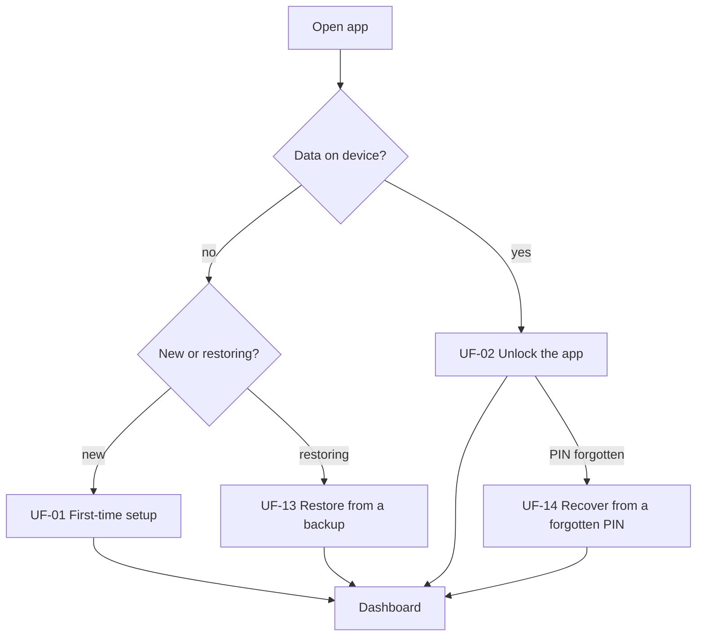
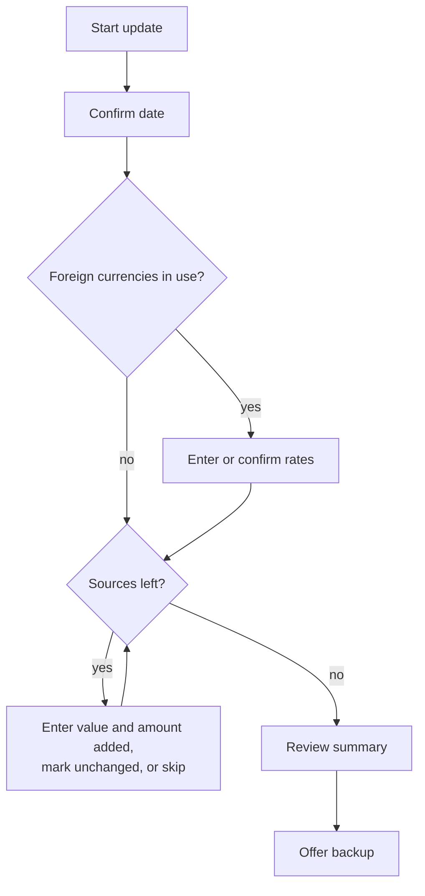

# Fortuna user flows

This document describes what a user does with Fortuna, as a set of user stories with the steps and rules for each. It builds on the [architecture](architecture.md) and uses its terms: source, snapshot, category, currency, exchange rate, amount added and base currency.

Like the architecture, it says nothing about implementation or technology. It also does not describe screen layout.

There is one kind of user: the owner of the device, tracking their own wealth.

## Overview

| ID | Flow | How often | Release |
|---|---|---|---|
| [UF-01](#uf-01-first-time-setup) | First-time setup | Once | MVP |
| [UF-02](#uf-02-unlock-the-app) | Unlock the app | Every use | MVP, PIN only |
| [UF-03](#uf-03-add-a-source) | Add a source | Occasionally | MVP |
| [UF-04](#uf-04-periodic-update) | Periodic update | Regularly, for example monthly | MVP, basic |
| [UF-05](#uf-05-update-a-single-source) | Update a single source | Occasionally | MVP |
| [UF-06](#uf-06-correct-or-backfill-history) | Correct or backfill history | Rarely | MVP, basic |
| [UF-07](#uf-07-close-a-source) | Close a source | Rarely | Future |
| [UF-08](#uf-08-manage-categories) | Manage categories | Rarely | Future |
| [UF-09](#uf-09-manage-currencies-and-rates) | Manage currencies and rates | Occasionally | MVP, basic |
| [UF-10](#uf-10-view-net-worth-over-time) | View net worth over time | Every use | MVP, basic |
| [UF-11](#uf-11-view-a-source) | View a source | Often | MVP, basic |
| [UF-12](#uf-12-back-up) | Back up | After each update | MVP |
| [UF-13](#uf-13-restore-from-a-backup) | Restore from a backup | Rarely | MVP |
| [UF-14](#uf-14-recover-from-a-forgotten-pin) | Recover from a forgotten PIN | Rarely | MVP |
| [UF-15](#uf-15-import-history-from-a-spreadsheet) | Import history from a spreadsheet | Once or twice | Future |
| [UF-16](#uf-16-change-security-settings) | Change security settings | Rarely | Future |

The release column shows where each flow falls in the [roadmap](roadmap.md), which also says which parts of a "basic" flow come later.

## Getting in

### UF-01 First-time setup

As a new user, I want to secure the app before I enter anything, so that my data is protected from the first entry.

Steps:

1. The app explains that data stays on the device, that there is no account, and that losing both the PIN and the recovery phrase means losing the data.
2. The user chooses a PIN and may turn on biometric unlock.
3. The app shows the recovery phrase and asks the user to write it down.
4. The app asks for part of the phrase back, to confirm it was recorded.
5. The user chooses a base currency.
6. The app offers starter categories (cash, investments, property, pension, debt). The user can keep, rename or remove them.
7. The app offers to add a first source (UF-03), import history (UF-15) or go to the empty dashboard.

Rules:

- The recovery phrase confirmation cannot be skipped.
- No financial data can be entered before the PIN and recovery phrase exist.

### UF-02 Unlock the app

As a returning user, I want to get in quickly, and I want nobody else to get in at all.

Steps:

1. The user opens the app and sees the lock screen.
2. The user unlocks with biometric or PIN.
3. The app opens on the dashboard, or returns to the screen the user was on if it locked while in use.

Rules:

- The app locks again shortly after it leaves the foreground.
- Anything the user had typed before the app locked is still there after unlocking, so looking up a balance in another app does not lose an entry.
- Financial figures are not visible in the device's app switcher.
- Each failed attempt makes the user wait longer before the next one.
- The lock screen offers the recovery phrase as a way in (UF-14).

### UF-14 Recover from a forgotten PIN

As a user who has forgotten my PIN, I want to get back in with my recovery phrase, so that I do not lose my history.

Steps:

1. On the lock screen, the user chooses to use the recovery phrase.
2. The user enters the phrase.
3. The user sets a new PIN and may turn biometric unlock back on.
4. The app opens with all data intact.

Rules:

- A wrong phrase changes nothing.
- The recovery phrase itself stays the same.

## Recording

### UF-03 Add a source

As a user, I want to add a new account, asset or debt, so that it counts toward my net worth from now on.

Steps:

1. The user enters a name and picks a category. The app shows whether that category is an asset or a liability.
2. The user picks the source's currency.
3. The user enters the opening value and its date, and an optional note.
4. The user sets how often they expect to update the source, or keeps the default.
5. If the currency is not the base currency and has no rate on or before that date, the app asks for one.
6. The source appears on the dashboard and in the periodic update.

Rules:

- The opening snapshot has no amount added.
- The opening date can be in the past.
- A liability's value is entered as a positive amount.
- Names are unique among active sources.

### UF-04 Periodic update

As a user, I want to bring all my balances up to date in one sitting, so that keeping the tracker current takes a few minutes.

Steps:

1. The user starts an update. The date defaults to today and can be changed.
2. For each foreign currency in use, the app shows the last rate and its age, and the user enters a new rate or keeps the old one.
3. The app walks through the active sources one at a time, starting with the one updated longest ago. For each, it shows the last value and date, and the user does one of three things:
   - enters the new value, the amount added since the last snapshot and an optional note
   - marks it unchanged, which records the same value with nothing added
   - skips it, which records nothing
4. The app shows a summary: the change in net worth since the previous update, split into added, growth, currency effect and newly tracked sources.
5. The app offers to make a backup (UF-12).

Rules:

- Amount added defaults to zero.
- The previous update is the most recent earlier date on which any snapshot was recorded.
- A fresh exchange rate is optional. The user can keep the last rate, and the app shows its age so they can decide.
- Each entry is saved as it is made, so the user can stop part-way and lose nothing.
- A skipped source keeps its last value in the totals and is shown as out of date.
- If a new value is very different from the last one, the app asks the user to confirm it, to catch typing mistakes.
- Moving money between two sources is recorded as a negative amount added on one and a positive amount added on the other. The two cancel out in the total.

### UF-05 Update a single source

As a user, I want to record a new value for one source without going through all of them.

Steps:

1. From the source's page, the user chooses to add a value.
2. The user enters the value, the amount added, the date and an optional note.
3. The source's history and the totals update.

Rules:

- The same rules apply as for an entry in the periodic update.
- The date defaults to today. A past date is a backfill (UF-06).

### UF-06 Correct or backfill history

As a user, I want to fix a wrong entry or add an older value I have just found, so that my history is accurate.

Steps:

1. From the source's page, the user picks a snapshot to edit or delete, or adds one with a past date.
2. The user makes the change.
3. The app shows which later figures are affected and asks the user to confirm.

Rules:

- Entering a snapshot on a date that already has one replaces it, after confirmation.
- Amount added always covers the period since the previous snapshot. Adding a snapshot between two existing ones shortens the period the later one covers, so the app subtracts the new snapshot's amount added from the later one and shows the result for the user to accept or change.
- Deleting a snapshot lengthens the period the next one covers, so the app adds the deleted amount added to the next snapshot and shows the result for the user to accept or change.
- If the earliest snapshot is deleted, the next one becomes the opening balance.

### UF-07 Close a source

As a user, I want to close a source when an account is closed, an asset is sold or a debt is repaid, so that it stops counting but its history remains.

Steps:

1. From the source's page, the user chooses to close it and gives the closing date.
2. The app records a final snapshot with a value of zero. The amount added defaults to minus the last value, meaning the money was moved out. The user can change it, for example when an asset was written off.
3. The source is archived.

Rules:

- An archived source is left out of the periodic update and the list of active sources. It still appears in history and charts.
- An archived source can be reopened.
- A source is never deleted if it has history. The one exception is a source created by mistake that has only its opening snapshot.

### UF-08 Manage categories

As a user, I want to organise my sources into groups that make sense to me.

Steps:

1. The user adds a category and sets it as asset or liability, or renames or archives an existing one.
2. The user can move a source to another category of the same kind.

Rules:

- A category's kind cannot change once it has sources.
- A category with sources cannot be archived until the sources are moved or archived.

### UF-09 Manage currencies and rates

As a user with money in more than one currency, I want to keep exchange rates up to date, so that my totals are meaningful.

Steps:

1. The user adds a currency, or opens an existing one to see its rate history.
2. The user adds a rate for a date, or edits or deletes an existing rate.
3. Totals and charts are recalculated.

Rules:

- The base currency always has a rate of one.
- A foreign currency needs a rate on or before its earliest snapshot. The app will not let that rate be deleted.
- Changing the base currency is a separate, deliberate action. The app works out the new rates from the existing ones where it can, and asks the user for any that are missing.

### UF-15 Import history from a spreadsheet

As a user who has tracked my wealth elsewhere, I want to bring that history in, so that I do not start from nothing.

Steps:

1. The user gets an empty template from the app. It is deliberately simple: one row per value, with columns for source, date, value, amount added and currency.
2. The user fills it in outside the app.
3. The user picks the filled-in file.
4. The app shows a preview and lists anything that needs a decision:
   - sources that do not exist yet, to create
   - dates that already have a snapshot, to replace or skip
   - foreign currencies with no rate, to enter
5. The user resolves these and confirms.
6. The history appears.

Rules:

- Only files that follow the template are accepted.
- The file is not protected by the app, so the app tells the user to delete it once the import is done.
- Nothing is written until the user confirms.
- The import either succeeds completely or changes nothing.

## Insights

### UF-10 View net worth over time

As a user, I want to see my net worth and how it has changed, so that I know where I stand.

Steps:

1. The dashboard shows current net worth in the base currency, with total assets and total liabilities.
2. A timeline shows net worth over a period the user chooses.
3. For that period, the app shows the change split into added, growth, currency effect and newly tracked sources.
4. The app shows how the total is divided between categories.
5. The app lists sources with their current value and how long ago each was updated.

Rules:

- Every figure is in the base currency unless stated.
- Each source has an expected update frequency, such as monthly or yearly, starting from a default. A source is marked as out of date once that period has passed since its last snapshot.
- A source counts from the date of its opening snapshot and not before. Its opening balance appears in the split as newly tracked, since it is neither added nor growth.

### UF-11 View a source

As a user, I want to see how one source has performed, so that I can tell what I put in from what it earned.

Steps:

1. The user opens a source from the dashboard.
2. The app shows its value over time in its own currency.
3. The app lists its snapshots, each with the change since the previous one, the amount added and the growth.
4. The app shows totals since the opening balance: total added and total growth.
5. For a foreign-currency source, the user can switch to the base currency, which adds the currency effect.

Rules:

- For a liability, amount added means new borrowing minus repayments, and growth means interest and charges.

## Protecting the data

### UF-12 Back up

As a user, I want a copy of my data that I control, so that losing my phone does not mean losing my history.

Steps:

1. The user chooses to back up, or accepts the offer at the end of a periodic update.
2. The app produces one encrypted file containing everything.
3. The user chooses where to keep it.

Rules:

- The file can only be opened with the recovery phrase. The user does not need to enter the phrase to make a backup.
- The app never sends the file anywhere itself. The user decides where it goes.
- The app shows when the last backup was made and whether data has changed since.

### UF-13 Restore from a backup

As a user with a new or reset device, I want to restore my data from a backup file.

Steps:

1. On a fresh install, the user chooses to restore.
2. The user picks the backup file and enters the recovery phrase.
3. The user sets a PIN and may turn on biometric unlock.
4. The app opens with the restored data.

Rules:

- A wrong phrase or a damaged file changes nothing.
- Restoring replaces the data on the device. It does not merge.
- Restoring into an app that already holds data requires explicit confirmation.

### UF-16 Change security settings

As a user, I want to change how I unlock the app, or replace my recovery phrase if I think someone has seen it.

Steps:

1. After unlocking again, the user changes the PIN, turns biometric unlock on or off, or asks for a new recovery phrase.
2. For a new recovery phrase, the app shows it and confirms it as in first-time setup, then offers to make a fresh backup.

Rules:

- Changing the PIN does not affect backups.
- A new recovery phrase also replaces the key that protects the data, so the old phrase cannot open anything made afterwards.
- Backups made before a recovery phrase change can only be opened with the old phrase. The app says so and recommends a new backup straight away.
